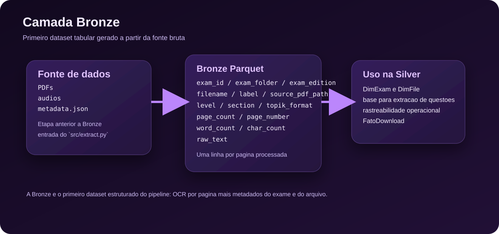

# Modelo da Camada Bronze

Este documento descreve a estrutura conceitual da camada Bronze do projeto. Nesta etapa, o foco ja nao e mais a fonte bruta em si, mas o primeiro dataset estruturado gerado a partir dela: um conjunto Parquet por edicao contendo texto extraido pagina a pagina.

No contexto deste projeto, PDFs, audios e `metadata.json` pertencem a uma etapa anterior de fonte de dados. A Bronze comeca quando `src/extract.py` processa os PDFs e grava os resultados em `data/bronze`.

## Visao geral

Na camada Bronze, os dados ainda estao proximos da fonte original, mas ja foram convertidos para uma estrutura tabular. O objetivo principal e preservar o conteudo extraido dos PDFs com contexto suficiente para rastrear exame, arquivo e pagina.

Hoje, a Bronze e gravada em Parquet, com um dataset por edicao do exame e uma linha por pagina processada.

## Visualizacao da estrutura

| Estrutura | Granularidade | Formato | Papel |
| --- | --- | --- | --- |
| dataset Bronze consolidado | Uma linha por pagina extraida | Parquet | Preservar OCR, metadados do arquivo e contexto do exame |

## Dataset principal

### Parquet por edicao

Cada dataset Parquet representa uma edicao de exame processada pela Bronze.

Localizacao esperada:

- `data/bronze/`

Formato:

- Parquet

Papel no pipeline:

- preservar o texto bruto extraido por OCR;
- manter os metadados do exame e do arquivo usados na extracao;
- servir como base para a modelagem dimensional da Silver.

## Campos principais

Cada linha do dataset Bronze representa uma pagina de um PDF processado e pode conter os seguintes campos:

- `exam_id`: identificador do exame gerado no processamento.
- `exam_folder`: pasta de origem da edicao.
- `exam_edition`: edicao extraida do contexto do exame.
- `filename`: nome do PDF processado.
- `label`: rotulo legivel do arquivo.
- `exam_number`, `exam_year`, `exam_month`, `exam_session`: metadados temporais do exame.
- `topik_format`, `level`, `section`: classificacao do material.
- `file_type`: tipo do arquivo considerado no processamento.
- `source_url`, `page_url`: referencias de origem.
- `download_date`, `size_kb`, `download_status`: informacoes operacionais do download.
- `source_pdf_path`: caminho local absoluto do PDF.
- `processed_at`: timestamp do processamento.
- `page_count`: total de paginas do PDF.
- `page_number`: numero da pagina da linha atual.
- `word_count`, `char_count`: metricas simples do texto extraido.
- `raw_text`: texto bruto retornado pelo OCR.

### Tabela em Markdown: uma linha por pagina do Parquet Bronze

| Campo | Tipo esperado | Descricao |
| --- | --- | --- |
| `exam_id` | `string` | Identificador do exame |
| `exam_folder` | `string` | Pasta de origem da edicao |
| `exam_edition` | `string` | Edicao do exame |
| `filename` | `string` | Nome do PDF processado |
| `label` | `string` | Rotulo legivel do arquivo |
| `exam_number` | `string` | Numero da edicao da prova |
| `exam_year` | `string` | Ano do exame |
| `exam_month` | `string/null` | Mes do exame, quando disponivel |
| `exam_session` | `string/null` | Sessao do exame, quando disponivel |
| `topik_format` | `string` | Formato da prova |
| `level` | `string` | Nivel do exame |
| `section` | `string` | Secao do material |
| `file_type` | `string` | Tipo do arquivo |
| `source_url` | `string` | URL direta do download |
| `page_url` | `string` | URL da pagina de origem |
| `download_date` | `string` | Data do download |
| `size_kb` | `float` | Tamanho do arquivo em KB |
| `download_status` | `string` | Resultado final do download |
| `source_pdf_path` | `string` | Caminho absoluto do PDF processado |
| `processed_at` | `string` | Timestamp da execucao |
| `page_count` | `int` | Quantidade total de paginas do PDF |
| `page_number` | `int` | Numero da pagina representada |
| `word_count` | `int` | Quantidade de palavras do texto extraido |
| `char_count` | `int` | Quantidade de caracteres do texto extraido |
| `raw_text` | `string` | Texto bruto extraido por OCR |

## Como pensar isso em PySpark

Embora a Bronze nao seja, por definicao, a camada mais rica em modelagem, ela ainda pode ser consumida com PySpark nas etapas seguintes.

Alguns pontos praticos:

- a Bronze nasce explicitamente como DataFrame Spark persistido em Parquet;
- a granularidade adotada e uma linha por pagina de PDF;
- os metadados da fonte continuam carregados junto do texto extraido para manter auditabilidade.

Em outras palavras, a Bronze funciona como o primeiro produto tabular confiavel do pipeline.

## Mapeamento fisico esperado

| Camada | Persistencia atual | Unidade logica | Observacao |
| --- | --- | --- | --- |
| Fonte | `data/topik_papers/<edition>` | PDFs, audios e metadata.json | Material bruto anterior a Bronze |
| Bronze | `data/bronze/` | Uma linha por pagina processada | Dataset Parquet gerado por `src/extract.py` |

## Relacao com a camada Silver

Os dados da Bronze alimentam diretamente a Silver:

- os metadados do exame ajudam a formar estruturas como `DimExam` e `DimFile`;
- o texto bruto por pagina sustenta a extracao de questoes e respostas;
- os caminhos, URLs e timestamps sustentam a rastreabilidade do pipeline.

## Uso esperado

Essa camada atende principalmente a objetivos operacionais:

- rastrear downloads realizados;
- preservar a origem dos arquivos;
- possibilitar reprocessamento;
- oferecer uma base confiavel para OCR, extracao de texto e transformacoes posteriores.

Em resumo, a Bronze e a primeira camada estruturada do projeto: ainda proxima da fonte, mas ja pronta para leitura tabular e processamento incremental.