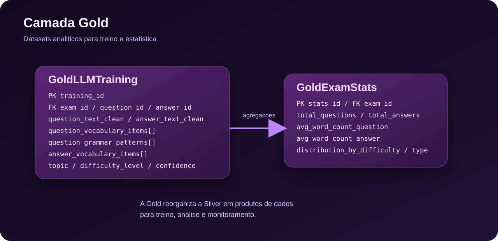

# Modelo da Camada Gold

Este documento descreve a estrutura conceitual da camada Gold do projeto. Aqui, o objetivo nao e representar tabelas SQL de forma literal, mas definir datasets analiticos prontos para consumo, estudo e treinamento de modelos, usando PySpark e armazenamento em Parquet.

Enquanto a camada Silver organiza entidades e relacionamentos operacionais, a camada Gold consolida dados em formatos mais diretos para analise e reutilizacao em tarefas de NLP e monitoramento.

## Visao geral

Na camada Gold, os dados ja passaram por extracao, limpeza e enriquecimento. O foco agora e oferecer conjuntos de dados curados, com menos ruído operacional e mais valor analitico.

Neste modelo, a Gold foi dividida em dois datasets principais:

- `vw_llm_training`: view analitica com exemplos de treino no formato ChatML, pronta para consumo via `Dataset.from_spark()`.
- `GoldExamStats`: tabela agregada com metricas e estatisticas sobre os exames e suas questoes.

## Visualizacao da estrutura

| Estrutura | Tipo | Granularidade | Papel |
| --- | --- | --- | --- |
| `vw_llm_training` | View analitica | Uma linha por questao completa (com todas as alternativas consolidadas) | Exportacao pronta para fine-tuning via `Dataset.from_spark()` |
| `GoldExamStats` | Dataset agregado | Uma linha por exame | Resumo estatistico para analise e monitoramento |

## View principal para treino

### vw_llm_training

View analitica que produz exemplos de treino no formato ChatML (system / user / assistant), com granularidade de uma linha por questao completa.

A unidade logica e a questao inteira: o enunciado, o estimulo (se houver) e todas as alternativas sao consolidados em um unico campo `messages` dentro do proprio Spark, antes da conversao para HuggingFace Dataset. Isso garante que o processamento pesado (joins, agregacoes, formatacao de texto) ocorra no cluster Spark, e nao no Python pos-conversao.

O campo `messages` segue o formato `ArrayType(StructType)` mapeado diretamente para `list[dict]` pelo Arrow, que e a estrutura esperada por `datasets.Dataset.from_spark()` e compativel com `trl.SFTTrainer` e `apply_chat_template`. A view nao carrega atributos linguisticos detalhados (vocabulary, grammar patterns) — esses permanecem na Silver e podem ser usados para experimentos futuros ou como colunas adicionais em variantes da view.

Estrutura do campo `messages` (sempre 3 elementos, nesta ordem):

- `messages[0]` — `role: "system"`: instrucao de papel fixa, definindo o modelo como gerador de questoes TOPIK.
- `messages[1]` — `role: "user"`: solicitacao parametrizada com os campos `topic`, `difficulty_level` e `exam_level`, montada em Spark via expressoes de string.
- `messages[2]` — `role: "assistant"`: resposta esperada — enunciado limpo + estimulo (se presente) + alternativas numeradas com indicacao da correta, montada via `collect_list` e `concat_ws` a partir de `dim_answer`.

Colunas de metadados (`exam_level`, `topic`, `difficulty_level`, `confidence`) sao mantidas como strings planas fora do array `messages` para viabilizar filtragem e estratificacao de splits (treino/validacao/teste) sem precisar desempacotar a estrutura aninhada.

| Campo | Tipo Spark | Descricao |
| --- | --- | --- |
| `training_id` | `StringType` | Identificador unico do exemplo de treino (derivado do `question_id`) |
| `exam_id` | `StringType` | Referencia ao exame de origem |
| `question_id` | `StringType` | Referencia a questao (para rastreabilidade) |
| `messages` | `ArrayType(StructType([role: StringType, content: StringType]))` | Conversa no formato ChatML com 3 turnos: system, user, assistant |
| `topik_level` | `StringType` | Nivel TOPIK (I ou II) — para filtragem por nivel |
| `topic` | `StringType` | Tema principal da questao — para filtragem tematica |
| `difficulty_level` | `StringType` | Nivel de dificuldade — para estratificacao de splits |
| `confidence` | `FloatType` | Score de confianca herdado da Silver — para filtrar exemplos de baixa qualidade |

## Dataset agregado de estatisticas

### GoldExamStats

Tabela agregada com metricas e estatisticas sobre os exames e suas questoes.

Essa estrutura existe para resumir o comportamento de cada exame de forma analitica. Ela e util para dashboards, monitoramento de cobertura, analise exploratoria e comparacoes entre edicoes da prova.

Campos principais:

- `stats_id`: identificador unico do registro agregado.
- `exam_id`: referencia ao exame resumido.
- `total_questions`: total de questoes do exame.
- `total_answers`: total de respostas ou alternativas vinculadas.
- `avg_word_count_question`: media de palavras por questao.
- `avg_word_count_answer`: media de palavras por resposta.
- `distribution_by_difficulty`: distribuicao agregada por dificuldade.
- `distribution_by_type`: distribuicao agregada por tipo de questao.
- `last_updated`: timestamp da ultima atualizacao do agregado.

Observacoes de implementacao:

- Os campos `distribution_by_difficulty` e `distribution_by_type` podem ser representados como `MapType(StringType, IntegerType)` no Spark ou como estruturas JSON serializadas, dependendo do padrao adotado no projeto.
- Esse dataset pode ser recalculado por exame a partir da camada Silver ou da propria Gold de treino.

| Campo | Tipo Spark sugerido | Descricao |
| --- | --- | --- |
| `stats_id` | `StringType` | Identificador unico do registro agregado |
| `exam_id` | `StringType` | Referencia ao exame |
| `total_questions` | `IntegerType` | Total de questoes do exame |
| `total_answers` | `IntegerType` | Total de respostas ou alternativas |
| `avg_word_count_question` | `DoubleType` | Media de palavras por questao |
| `avg_word_count_answer` | `DoubleType` | Media de palavras por resposta |
| `distribution_by_difficulty` | `MapType(StringType, IntegerType)` | Distribuicao por dificuldade |
| `distribution_by_type` | `MapType(StringType, IntegerType)` | Distribuicao por tipo |
| `last_updated` | `TimestampType` ou `StringType` | Momento da ultima atualizacao |

## Relacao com a camada Silver

As tabelas da Gold dependem diretamente das entidades descritas na Silver:

- `vw_llm_training` combina `DimExam`, `DimQuestion` e `DimAnswer` diretamente, consolida as alternativas por questao e monta o campo `messages` inteiramente em Spark.
- `GoldExamStats` resume os dados de questoes e respostas por exame.

Em termos praticos, a Silver organiza o dado em nivel de entidade. A Gold reorganiza esse mesmo conteudo em nivel de consumo analitico.

## Como pensar isso em PySpark

Esse modelo funciona bem com uma abordagem orientada a DataFrames:

- `vw_llm_training` e construida com joins entre `dim_question`, `dim_answer` e `dim_exam`, seguidos de `pivot` para agregar alternativas por questao, montagem do texto do `assistant` via `concat`, e construcao do array `messages` com `array(struct(...))`. O schema resultante e raso (apenas um nivel de aninhamento no `messages`), o que minimiza o overhead de serializacao Arrow no `Dataset.from_spark()`.
- `GoldExamStats` pode ser construida com agregacoes por `exam_id`, contagens, medias e colecoes estruturadas para distribuicoes.
- Campos de distribuicao podem ser modelados como mapas ou structs, em vez de texto plano.

## Uso esperado

Esses datasets da Gold atendem dois objetivos complementares:

- preparar dados confiaveis e padronizados para tarefas com modelos de linguagem;
- oferecer uma visao agregada da qualidade e do perfil dos exames processados.

Em outras palavras, a camada Gold transforma o resultado do pipeline em produtos de dados mais prontos para analise, experimentacao e treinamento.

## Mapeamento fisico esperado

| Camada | Persistencia sugerida | Unidade logica | Observacao |
| --- | --- | --- | --- |
| Gold | Parquet por dataset analitico | Uma linha por questao completa (`vw_llm_training`) ou por exame agregado (`GoldExamStats`) | Voltada a consumo via `Dataset.from_spark()`, fine-tuning e monitoramento |