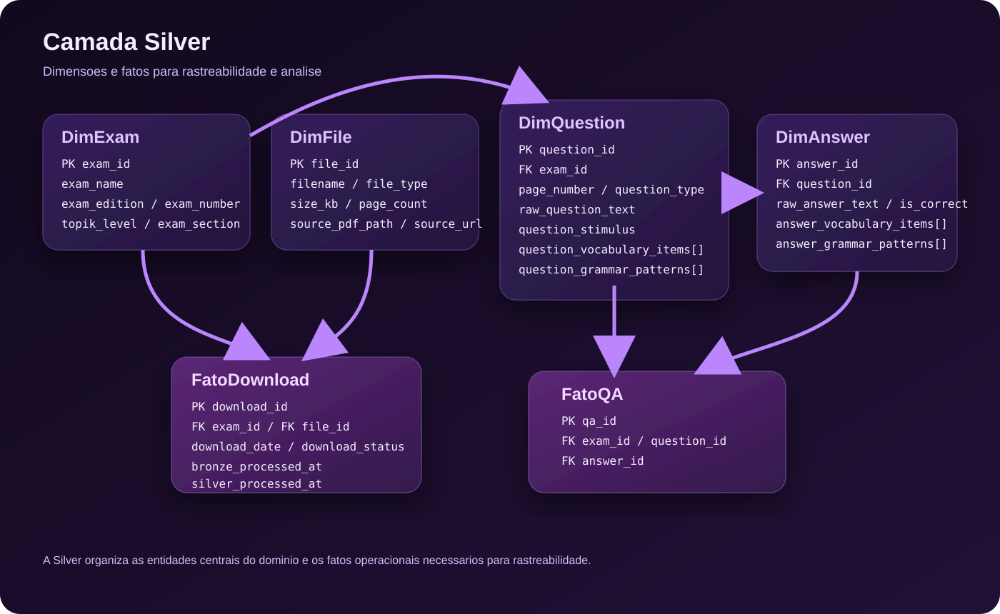

# Modelo Dimensional da Camada Silver

Este documento descreve o modelo dimensional pensado para a camada Silver do projeto. A ideia aqui nao e definir tabelas SQL literalmente, e sim registrar a estrutura logica que pode ser materializada com PySpark em DataFrames e arquivos Parquet.

O diagrama da camada prata serve como referencia conceitual para organizar os dados extraidos dos PDFs, os metadados dos exames e os relacionamentos entre questoes, respostas e arquivos processados.

## Visao geral

Na camada Silver, os dados ja passaram pela etapa inicial de ingestao e limpeza. Aqui, o foco e organizar o conteudo em entidades reutilizaveis para analise, rastreabilidade e enriquecimento posterior.

O modelo foi dividido em dois grupos:

- Dimensoes: descrevem entidades relativamente estaveis, como exame, arquivo, questao e resposta.
- Fatos: registram eventos ou relacionamentos relevantes para o pipeline, como downloads e ligacoes entre exame, questao e resposta.

## Visualizacao da estrutura

| Estrutura | Tipo | Granularidade | Papel |
| --- | --- | --- | --- |
| `DimExam` | Dimensao | Um registro por exame | Contexto academico e metadados da prova |
| `DimFile` | Dimensao | Um registro por arquivo | Origem fisica e informacoes tecnicas |
| `DimQuestion` | Dimensao | Um registro por questao | Enunciado e atributos extraidos |
| `DimAnswer` | Dimensao | Um registro por alternativa | Texto e atributos das respostas |
| `FatoDownload` | Fato | Um registro por evento de download/processamento | Observabilidade operacional |
| `FatoQA` | Fato | Um registro por relacao questao-resposta | Navegacao analitica entre entidades |

## Dimensoes

### DimExam

Tabela que descreve os metadados de cada exame, incluindo edicao, nivel e nome do PDF.

Essa entidade representa o contexto academico da prova. Ela concentra informacoes como numero da edicao, ano, mes, sessao, secao da prova e formato do TOPIK. Em PySpark, esse conjunto faz sentido como um DataFrame de referencia para enriquecer as demais entidades.

Campos principais:

- `exam_id`: identificador unico do exame.
- `exam_name`: nome legivel do exame ou do material.
- `exam_edition`: edicao textual, como `102nd`.
- `exam_number`: numero da prova, como `102`.
- `exam_year` e `exam_month`: recorte temporal da aplicacao.
- `exam_session`: sessao da prova, quando houver.
- `exam_section`: secao, como `Listening` ou `Reading`.
- `topik_level`: nivel do exame, como `TOPIK I`.
- `topik_format`: formato da prova, como `New Format`.

| Campo | Tipo Spark sugerido | Descricao |
| --- | --- | --- |
| `exam_id` | `StringType` | Identificador unico do exame |
| `exam_name` | `StringType` | Nome legivel do exame |
| `exam_edition` | `StringType` | Edicao textual, como `102nd` |
| `exam_number` | `StringType` | Numero da prova |
| `exam_year` | `IntegerType` ou `StringType` | Ano do exame |
| `exam_month` | `IntegerType` ou `StringType` | Mes do exame |
| `exam_session` | `StringType` | Sessao do exame |
| `exam_section` | `StringType` | Secao da prova |
| `topik_level` | `StringType` | Nivel do TOPIK |
| `topik_format` | `StringType` | Formato do exame |

### DimFile

Tabela que armazena informacoes tecnicas sobre os arquivos PDF baixados.

Essa dimensao existe para separar os aspectos fisicos do arquivo dos aspectos logicos do exame. Ela ajuda a rastrear origem, tamanho, tipo e caminho local do documento que alimentou o pipeline.

Campos principais:

- `file_id`: identificador unico do arquivo.
- `filename`: nome do arquivo.
- `file_type`: tipo do arquivo, como PDF, audio ou gabarito.
- `size_kb`: tamanho em KB.
- `page_count`: quantidade de paginas, quando aplicavel.
- `source_pdf_path`: caminho local do arquivo processado.
- `source_url`: URL de origem do download.

| Campo | Tipo Spark sugerido | Descricao |
| --- | --- | --- |
| `file_id` | `StringType` | Identificador unico do arquivo |
| `filename` | `StringType` | Nome do arquivo |
| `file_type` | `StringType` | Tipo do arquivo |
| `size_kb` | `DoubleType` | Tamanho em KB |
| `page_count` | `IntegerType` | Quantidade de paginas |
| `source_pdf_path` | `StringType` | Caminho local do arquivo |
| `source_url` | `StringType` | URL de origem |

### DimQuestion

Tabela que contem os textos e atributos das questoes extraidas das provas.

Essa e a entidade central para a etapa de NLP e extracao estruturada. Ela guarda o enunciado bruto e os atributos inferidos pelo pipeline, como tipo da questao, topico, dificuldade e sinais linguisticos.

Campos principais:

- `question_id`: identificador unico da questao.
- `exam_id`: referencia ao exame de origem.
- `page_number`: pagina onde a questao foi encontrada.
- `raw_question_text`: texto bruto do enunciado.
- `question_type`: classificacao da questao, como `vocabulary`, `grammar`, `reading comprehension` ou `image dependent`.
- `question_vocabulary_items`: lista de palavras-chave do enunciado.
- `question_grammar_patterns`: lista de padroes gramaticais detectados no enunciado.
- `topic`: tema principal da questao.
- `difficulty_level`: classificacao de dificuldade.
- `confidence`: score de confianca da extracao.

Observacao de implementacao:

Os campos `question_vocabulary_items` e `question_grammar_patterns` fazem mais sentido como `ArrayType(StringType)` no Spark, mesmo que no diagrama estejam descritos como `varchar` por simplicidade.

| Campo | Tipo Spark sugerido | Descricao |
| --- | --- | --- |
| `question_id` | `StringType` | Identificador unico da questao |
| `exam_id` | `StringType` | Referencia ao exame |
| `page_number` | `IntegerType` | Pagina onde a questao foi encontrada |
| `raw_question_text` | `StringType` | Texto bruto do enunciado |
| `question_type` | `StringType` | Tipo da questao |
| `question_vocabulary_items` | `ArrayType(StringType)` | Palavras-chave do enunciado |
| `question_grammar_patterns` | `ArrayType(StringType)` | Padroes gramaticais do enunciado |
| `topic` | `StringType` | Tema principal |
| `difficulty_level` | `StringType` | Classificacao de dificuldade |
| `confidence` | `DoubleType` | Score de confianca da extracao |

### DimAnswer

Tabela que guarda as respostas associadas as questoes, indicando se sao corretas.

Essa dimensao detalha cada alternativa vinculada a uma questao. Ela permite armazenar tanto o texto da resposta quanto atributos linguisticos que podem ser usados em analises futuras ou em geracao de material de estudo.

Campos principais:

- `answer_id`: identificador unico da resposta.
- `question_id`: referencia a questao de origem.
- `raw_answer_text`: texto bruto da alternativa.
- `is_correct`: indicador logico da alternativa correta.
- `answer_vocabulary_items`: lista de palavras-chave presentes na resposta.
- `answer_grammar_patterns`: lista de padroes gramaticais presentes na resposta.

Observacao de implementacao:

Assim como em `DimQuestion`, os campos de vocabulario e gramatica podem ser representados no Spark como arrays de strings.

| Campo | Tipo Spark sugerido | Descricao |
| --- | --- | --- |
| `answer_id` | `StringType` | Identificador unico da resposta |
| `question_id` | `StringType` | Referencia a questao |
| `raw_answer_text` | `StringType` | Texto bruto da alternativa |
| `is_correct` | `BooleanType` | Indicador de resposta correta |
| `answer_vocabulary_items` | `ArrayType(StringType)` | Palavras-chave da resposta |
| `answer_grammar_patterns` | `ArrayType(StringType)` | Padroes gramaticais da resposta |

## Fatos

### FatoDownload

Tabela de fatos que registra eventos de download e processamento dos arquivos.

Essa entidade serve para observabilidade do pipeline. Ela conecta exame e arquivo ao evento operacional de download e as etapas de processamento nas camadas Bronze e Silver.

Campos principais:

- `download_id`: identificador unico do evento.
- `exam_id`: referencia ao exame.
- `file_id`: referencia ao arquivo.
- `download_date`: data e hora do download.
- `download_status`: status final do download.
- `bronze_processed_at`: momento em que o arquivo entrou ou foi processado na Bronze.
- `silver_processed_at`: momento em que o arquivo foi transformado para a Silver.

Em PySpark, essa estrutura pode ser especialmente util para auditoria, reprocessamento e monitoramento da qualidade operacional.

| Campo | Tipo Spark sugerido | Descricao |
| --- | --- | --- |
| `download_id` | `StringType` | Identificador unico do evento |
| `exam_id` | `StringType` | Referencia ao exame |
| `file_id` | `StringType` | Referencia ao arquivo |
| `download_date` | `TimestampType` ou `StringType` | Data e hora do download |
| `download_status` | `StringType` | Status final do download |
| `bronze_processed_at` | `TimestampType` ou `StringType` | Momento de processamento na Bronze |
| `silver_processed_at` | `TimestampType` ou `StringType` | Momento de processamento na Silver |

### FatoQA

Tabela de fatos que relaciona exames, questoes e respostas para analise.

Essa entidade formaliza o relacionamento entre o exame, a questao e cada alternativa. Ela e util quando se quer analisar o conjunto questao-resposta como uma unidade analitica, por exemplo para estatisticas por tipo de questao, frequencia de temas ou cobertura de vocabulario.

Campos principais:

- `qa_id`: identificador unico da relacao.
- `exam_id`: referencia ao exame.
- `question_id`: referencia a questao.
- `answer_id`: referencia a resposta.

| Campo | Tipo Spark sugerido | Descricao |
| --- | --- | --- |
| `qa_id` | `StringType` | Identificador unico da relacao |
| `exam_id` | `StringType` | Referencia ao exame |
| `question_id` | `StringType` | Referencia a questao |
| `answer_id` | `StringType` | Referencia a resposta |

## Relacionamentos principais

- Um exame pode estar associado a varios arquivos.
- Um exame pode conter varias questoes.
- Cada questao pode conter varias respostas.
- Cada evento de download conecta um exame a um arquivo processado.
- A entidade `FatoQA` permite navegar entre exame, questao e resposta de forma explicita.

## Como pensar isso em PySpark

Mesmo usando a nomenclatura de dimensoes e fatos, a implementacao pratica pode continuar totalmente orientada a PySpark:

- Cada entidade pode ser um DataFrame com schema explicito.
- Campos multivalorados, como vocabulario e padroes gramaticais, podem ser `ArrayType(StringType)`.
- Os dados podem ser persistidos em Parquet por entidade ou por dominio.
- Chaves como `exam_id`, `question_id` e `answer_id` podem ser geradas no pipeline para manter rastreabilidade entre transformacoes.

Em outras palavras, o modelo nao exige um banco relacional. Ele funciona como uma camada semantica para organizar os datasets intermediarios do pipeline.

## Mapeamento fisico esperado

| Camada | Persistencia sugerida | Unidade logica | Observacao |
| --- | --- | --- | --- |
| Silver | Parquet por entidade ou dominio | Uma linha por entidade ou evento | Ideal para joins, rastreabilidade e reuso em PySpark |